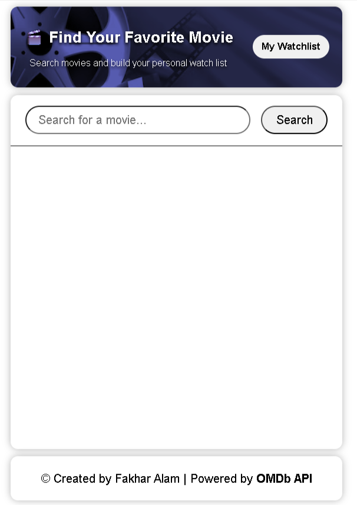
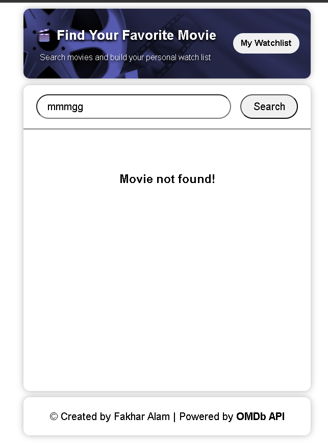
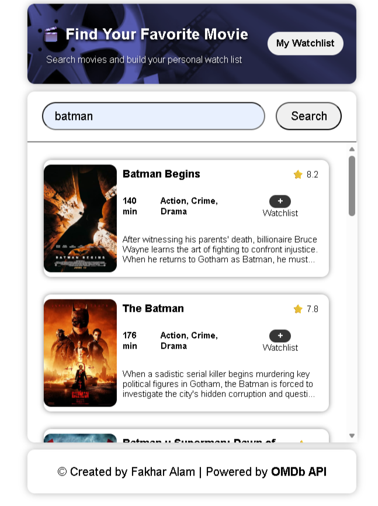
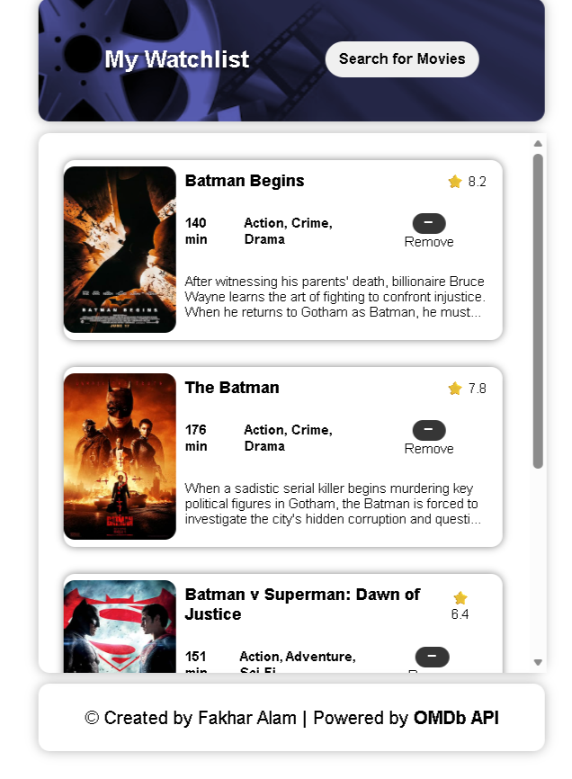

# 🎬 Movie Watch List

A simple and interactive web app to search movies and build your personal watchlist using the OMDb API.

---

## 🚀 Features

* 🔍 Search movies by title
* 🎞️ View movie details (poster, rating, runtime, genre, plot)
* ➕ Add movies to your watchlist
* ❌ Remove movies from your watchlist
* 💾 Persistent storage using **localStorage**
* 🔄 Single Page App (SPA) experience (no page reloads)

---

## 🎥 Demo (Screen Recording)

```bash
📁 screen-recording/
 ┗ 🎬 screen-recording.mp4
```

> Download and watch the demo video from the repository.

---

## 📸 Screenshots

### 🔎 Search Screen



---

### ❌ No Results State



---

### 🎬 Search Results



---

### 📌 Watchlist View



---

## 🧠 How It Works

1. User searches for a movie
2. App fetches results from OMDb API
3. Movies are displayed as interactive cards
4. User can:

   * Add movies to watchlist
   * Navigate to watchlist view
   * Remove movies anytime
5. Watchlist is stored in browser using `localStorage`

---

## 🛠️ Tech Stack

* HTML5
* CSS3 (Flexbox)
* JavaScript (ES6+)
* OMDb API

---

## 📁 Project Structure

```bash
📦 movie-watch-list
 ┣ 📜 index.html
 ┣ 📜 index.css
 ┣ 📜 script.js
 ┣ 📁 images
 ┗ 📁 screen-recordings
```

---

## ⚙️ Setup & Usage

```bash
git clone https://github.com/your-username/movie-watch-list.git
```

Open `index.html` in your browser.

---

## 🔑 API Used

https://www.omdbapi.com/

---

## ✨ Future Improvements

* ✔ Highlight already added movies
* 🎬 Movie detail modal
* ⚡ Optimize API calls with `Promise.all()`
* 📱 Responsive design

---

## 👤 Author

**Fakhar Alam**

* LinkedIn: https://www.linkedin.com/in/fakhar-e-alam-a046133b4/
* Scrimba: https://scrimba.com/?via=u43a7734

---

## 💡 Note

This project is part of my journey learning **Full Stack Development from Scrimba**.
Use my Scrimba link to start the same path.

---
